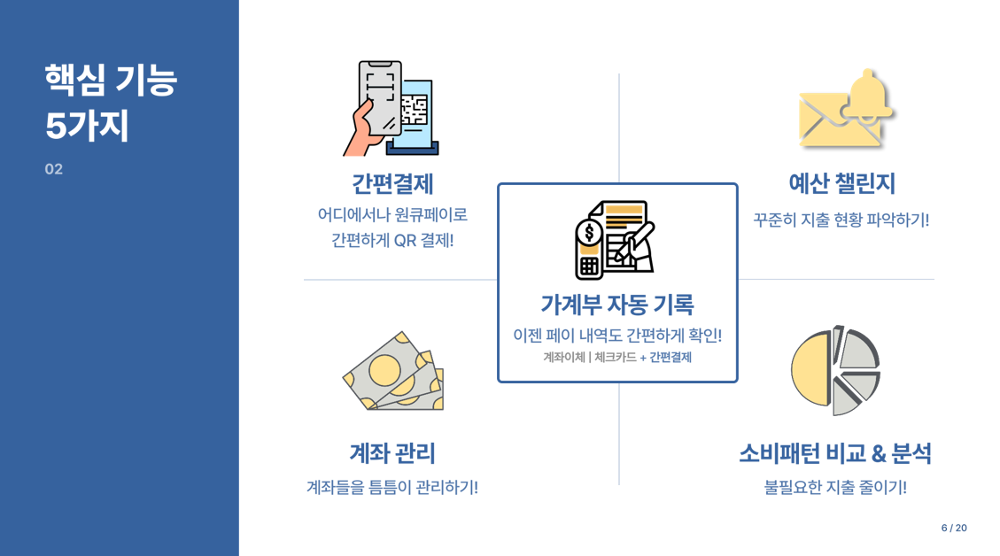

# 간편결제 서비스에 특화된 자산관리 챌린지 플랫폼

[프로젝트 홈페이지](https://koposoftware.github.io/2022_10_jbyun/)

# 1. 프로젝트 개요 및 목적

<h3>[ 개요 (문제점) ]</h3>
-	기존 가계부 앱은 계좌, 카드에 대한 거래내역은 기록해주지만, 간편결제 내역은 항상 빠져 있으므로 사용자가 가계부에 수동 입력해야 하는 불편함 존재
-	계좌로부터 하나머니(원큐페이) 충전 금액이 자동 이체되는 금액은 가계부에 기록이 남지만, 하나머니로 상품 구매 시 실제 결제 금액은 가계부에 찍히지 않음
-	매년 간편결제 이용자 수가 증가하는 추세이므로 간편결제에 대한 거래내역을 빈틈없이 관리해주고, 새어 나가는 지출을 줄일 수 있게 도와주는 시스템 필요
<h3>[ 목적 (해결책) ]</h3>
-	계좌 이체, 카드 결제, 간편결제에 대한 거래내역을 전부 자동으로 기록해주는 가계부 필요 (하나의 가계부에서 모두 관리)
-	간편결제 거래내역 데이터를 제공해주는 원큐페이 간편결제 시스템 구축
-	예산 챌린지로 불필요한 지출을 줄이며 가계부에서 지출 현황을 한 눈에 파악

# 2. 프로젝트 결과

## 2-1. 핵심기능 5가지
 
핵심기능은 크게 5가지로 이루어져 있습니다.

1.	가계부 자동 기록 : 계좌이체, 체크카드, 간편결제 (원큐페이, 카카오페이) 내역을 모두 자동으로 기록
2.	간편결제 (원큐페이) : 하나은행과 제휴를 맺은 가맹점에서 결제 시스템을 통해 원큐페이 간편결제를 진행 
3.	계좌 관리 : 계좌 이체, 계좌 목록 조회, 계좌 별 잔액 조회
4.	예산 챌린지 : 매달 목표 예산 금액을 설정하고 지출 현황을 알려주기 위해 카카오 메시지 전송
5.	소비패턴 비교 및 분석 : 사용자의 월별/주별 지출 현황, 많이 사용하는 결제 방법, 사용자와 비슷한 연령대인 다른 고객들의 평균 소비패턴을 비교 분석

## 2-2. 서비스 아키텍처
 
- 원큐페이 연동, 결제 요청, 결제 승인에 대한 Open API 문서는 아래에서 참고해주십시오.
- 사용자가 하나은행 시스템에서 이와 같은 계좌 관리 활동들을 할 수 있고, 3가지 거래내역을 가계부에 기록하여 소비패턴을 분석합니다.
- 예산 챌린지로 사용자의 지출 관리를 도와줍니다.
- 엄재철 교육생의 H.S. With 플랫폼 (주문 시스템)과 저의 원큐페이 시스템이 연동되어 있어서 원큐페이 간편결제 서비스를 제공합니다.

## 2-3. 시스템 아키텍처
 
- 프론트 : Bootstrap, HTML, CSS, JS
- 백엔드 : Java로 스프링 MVC 구조를 만들고 mybatis, 톰캣 서버, 오라클 DB를 사용

## 2-4. 원큐페이 OPEN API 문서
[문서링크 ](/open-api-document.pdf) 

## 2-5. 발표자료
[발표자료 ](/2260341014_윤정빈_발표.pdf) 

## 2-6. 시연 동영상 
<iframe width="677" height="328" src="https://www.youtube.com/embed/FGU6QUA8-pc" title="[최종프로젝트] 간편결제 서비스에 특화된 자산관리 챌린지 플랫폼 (윤정빈)" frameborder="0" allow="accelerometer; autoplay; clipboard-write; encrypted-media; gyroscope; picture-in-picture" allowfullscreen></iframe>

# 4. 프로젝트 상세

## 4-1. 사용기술
1.	Library
-	Full Calendar : 매달 지출, 수입 금액을 시각적으로 관리
-	QR Code Scanner : 원큐페이 결제 시 QR코드 스캔
-	junit (4.13.2) : 개발 시간 단축을 위해 테스트 코드 작성
-	Lombok (1.18.24) : 코드 길이 단축 및 오류 줄이기 위해 getter, setter, toString 자바 코드를 생성해주는 어노테이션 제공
-	Quartz Scheduler : 매일 03시에 챌린지 마감까지 남은 일수를 update
-	Faker : 다량의 의미 있는 더미 데이터 생성
-	Chart.js, AppexChart.js : 거래내역 기반 지출 분석 결과를 시각화
 
2.	자체개발 API
-	원큐페이 제휴 (연동) : 가맹점에게 간편결제 기능을 제공하기 위해 원큐페이와 제휴 요청
-	결제 요청 : 결제 방법으로 원큐페이 사용 시, QR 코드를 스캔하여 결제를 요청
-	결제 승인 : 결제가 성공적으로 완료되면 승인 결과(결제 내역)를 JSON 형태로 넘김
 
3.	Open API
-	카카오 로그인 : 홈페이지 로그인 시 호출
-	카카오 메시지 : 예산 챌린지 수행 중 지출 현황 알림, 매달 마지막날 챌린지 결과 알림
-	카카오페이 단건결제 : 가맹점에서 결제할 때 카카오페이 간편결제 방법 사용

## 4-2. 개발환경
1.	OS : Windows 11
2.	Server : Apache2, Tomcat9
3.	IDE/Tool : Eclipse, DA# Modeler5, SQL Developer, Postman, Maven
4.	Framework : Spring v2.7.3 (Spring MVC 기반 웹애플리케이션 개발), MyBatis v3.5.10, Bootstrap 4

## 4-3. ERD
 

## 4-4. 프로젝트 일정
2022.09.16 ~ 2022.10.25
 

# 5. 본인 소개

|이름      |윤정빈    ||
|연락처     |이메일    |binifia(@)gmail.com|
|skill set|Language|Java, JSP, HTML, CSS, Javascript/jQuery, C#, PL/SQL|
|         |TOOLS   |Spring, Mybatis|
|         |Database|Oracle, MSSQL|
|         |Etc     |Git, Oracle Cloud|
|자격증     |2021년   |SQLD|
|수상      |2020년   |한이음 ICT 공모전 / 보안 우회 시도를 차단할 수 있는 새로운 안면 인식 인증 방법 입선 |
